# Server Side Scripting
 
 
 # Hello Node
 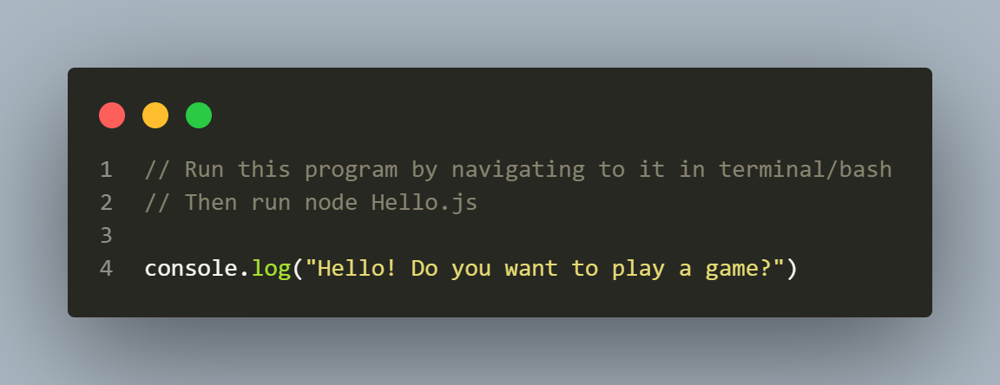
 
 # Console
 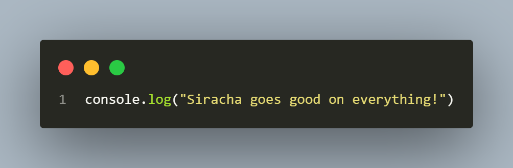
 
 # Arguments
 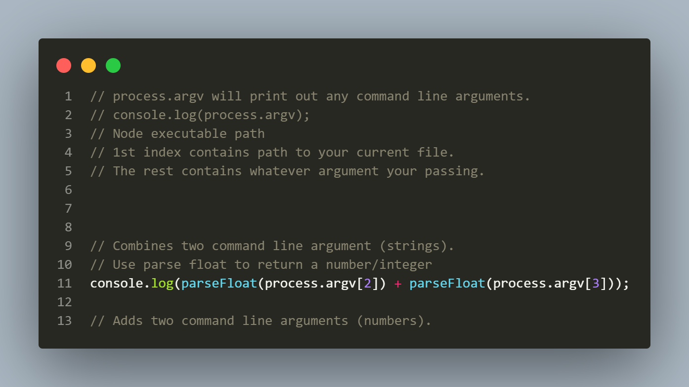
 
 # Check
 
 
 # Calculator
 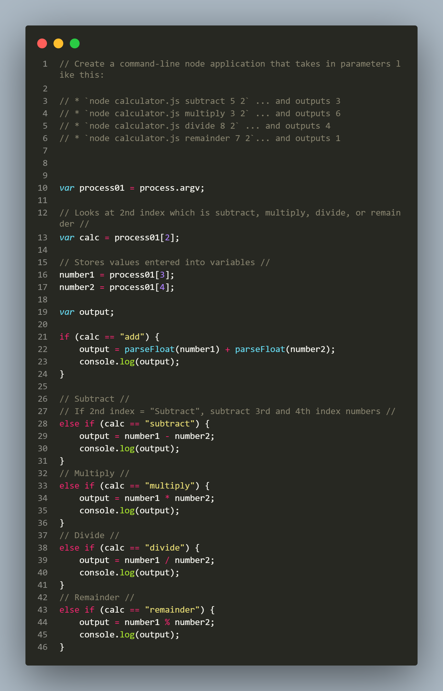
 
 # Modularization
 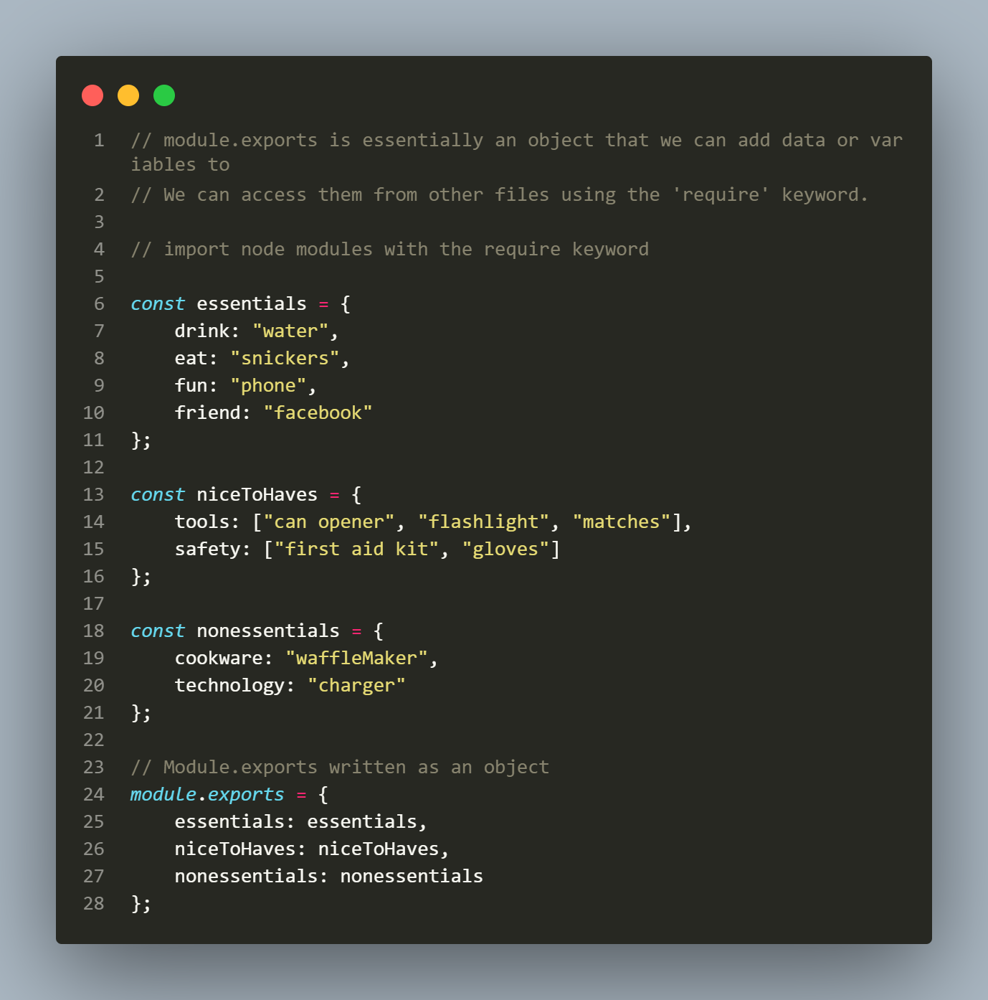
 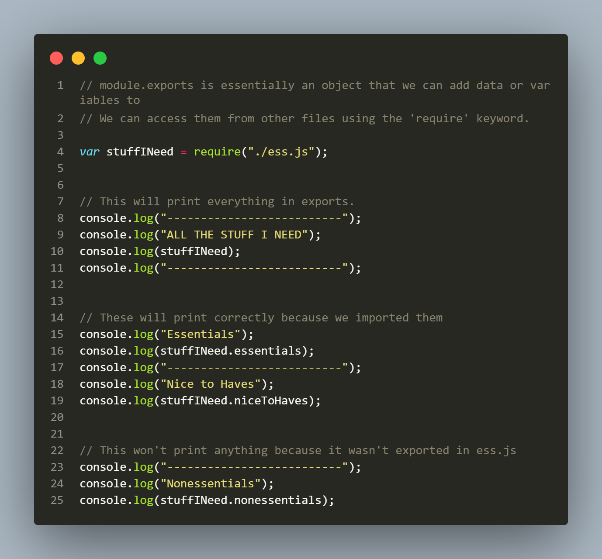
 
 # Bands
 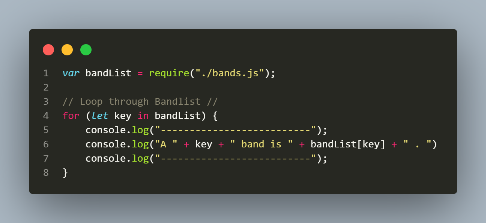
 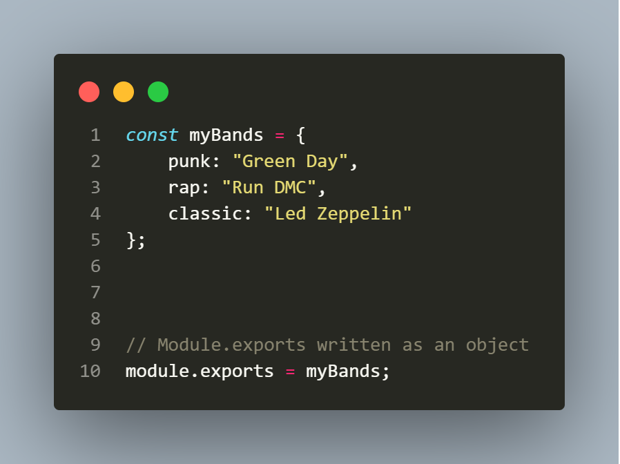
 
 # Read File
 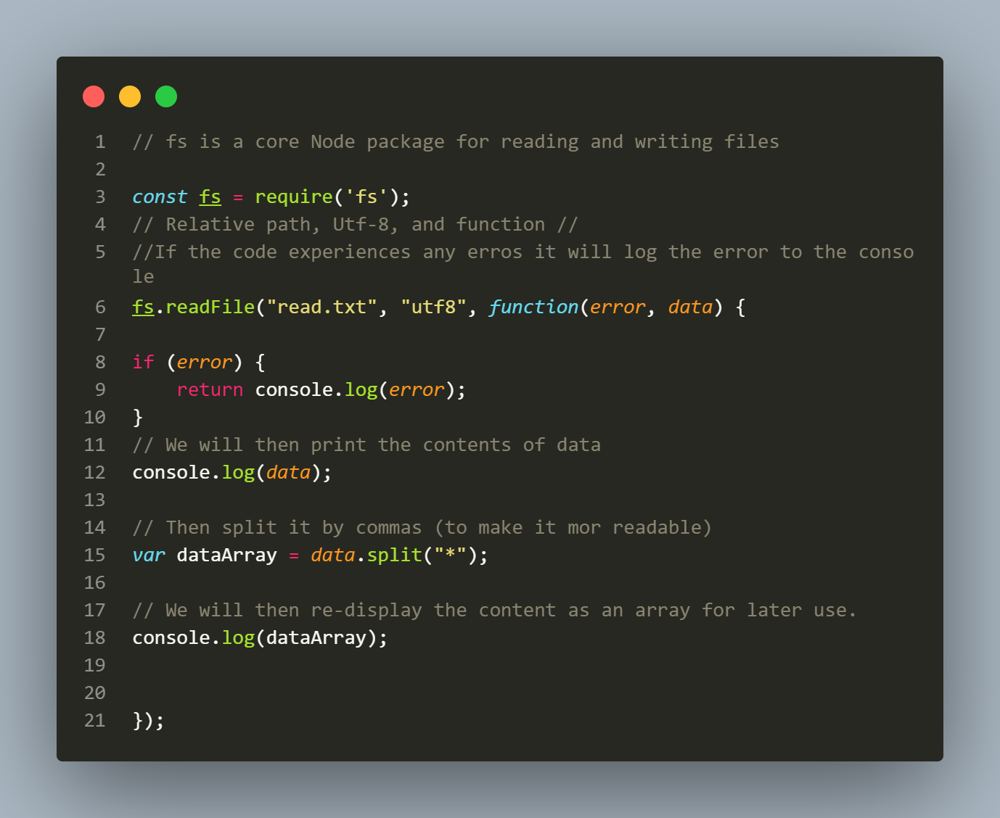
 
 # Write File
 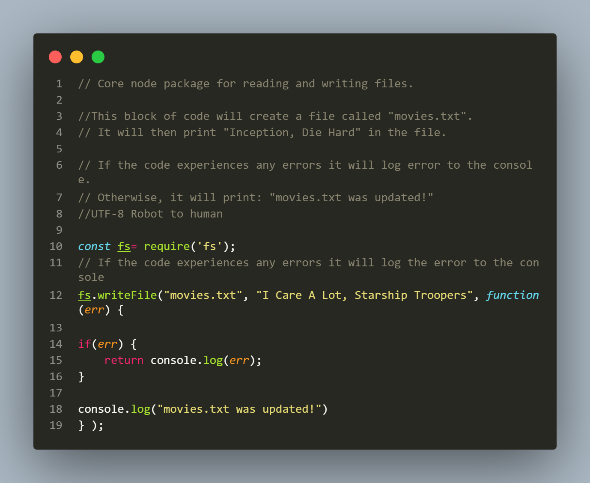
 
 # Append File
 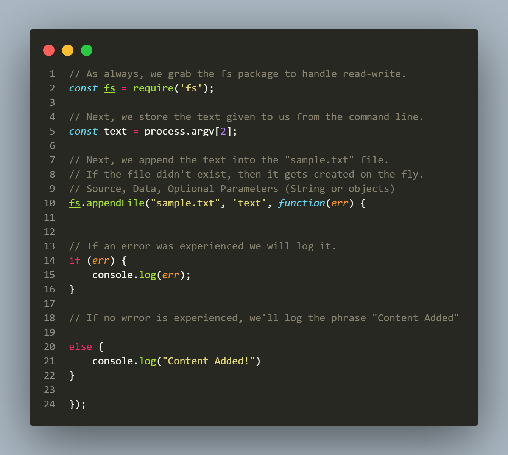
